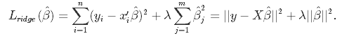
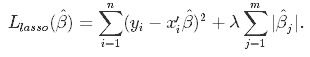

We return once again to the study that investigated the effect of a grit intervention on math scores. Even though the study was an experiment with thousands of participants, it couldn't shake off the threat of lurking confounders because the treatment was randomly assigned at the school level. We tried to adjust for confounders using classical and multilevel regression, which decreased the estimated effect by quite a bit. However, by doing so we introduced the possibility of model dependence. 

In the first section it is explained what model dependence is. Next, we discuss remedies, which consist of regularization and matching methods. Finally, I carry out a preferred matching method and see what happens to the estimated effect size.

## Model dependence
The standard practice of model fitting goes something like this. Fit a line through the data. If it doesn't match closely, transform the data or fit some kind of curve that follows the data more closely. Then look at the distance of the errors from the curve and possibly change the distribution that models the spread of the errors. This procedure seems reasonable. However, apart from the risk of overfitting, there is a lot of freedom for researchers to choose a model that inflates the desired result. 

Similarly, researchers choose whether to include variables or not in their models. In fact, we saw in part 2 that the exclusion of variables had a sizable effect on the estimation of the effect of `grit`. The result is, in other words, not robust to variable selection. 

These phenomena are referred to as 'model dependance', which arises from 'researcher degrees of freedom' (in choosing variables and choosing a model). The danger of inflating results is not imaginary, given that even the social science results published in the best journals [often fail to replicate](https://www.nature.com/articles/s41562-018-0399-z).

If one wanted to show the amount of model dependence, one would have to run hundreds of thousands of models, including all the combinations of selected variables, interactions, squared terms, etc. We will not do that here (but see [this paper](https://gking.harvard.edu/files/abs/counterf-abs.shtml) for an interesting approach). As we already noted significant model dependence in part 2 of this series, we focus on ways to reduce model dependance. 

In the next section we try to reduce researcher influence on variable selection. We then, in the final section, use matching methods in which we prune data points until we are left with closely matched pairs of subjects that are in the treatment and control groups.

```{r include=FALSE, warning=FALSE}
library(tidyverse)
library(haven)
library(MatchingFrontier)
library(glmnet)
library(mice)

sample1 <- read_dta("Sample1_Data.dta")
sample2 <- read_dta("Sample2_Data.dta")

```

### Ridge and Lasso regression
Our goal in this section is to minimize the influence of the researcher on variable selection by letting a penalized regression algorithm choose them for us. Just as in ordinary least squares regression, in penalized regression coefficients are optimized with regard to minimizing the squared distance of the predicted values to the outcome. However, a term is added to the optimization formula that penalizes the addition of coefficients. The result is that coefficients have to do more explanatory work to make it into the model. The promise of penalized regression for us is that it can tell us which variables make it to the next phase of the analysis.

There are two important ways in which the penalty term can be evaluated. To understand this, we must be a little bit more precise in our mathematical terminology. In order to minimize something we need a norm that gives us measuring tools for saying how big the thing is that we are minimizing. The L2 norm tells us to square the absolute difference between two vectors (the outcomes y and the predictions based on the vectors of coefficients multiplied by the data matrix). The choice of for L2 norm results in ridge regression. See the formula below. 

The value of lambda is chosen by cross validation. In this method the data set is split into a training set and a test set. After building the model based on the training data, it is evaluated on the test data set, which it has not seen before. Specifically, we run the model for lots of values of lambda in a reasonable interval and choose the one that minimizes the error in a test data set.

If we do not square the coefficient term and just take its absolute value, we are using an L1 norm. It results in lasso regression. For more on norms, see [this lecture](https://www.youtube.com/watch?v=NcPUI7aPFhA&list=PLUl4u3cNGP63oMNUHXqIUcrkS2PivhN3k&index=10). 

Lasso more aggressively eliminates coefficients. 

Both Lasso and Ridge regression are equivalent to a Bayesian regression with a harsh prior. This point of view is much more elegant, but I will stick with the regular interpretation here. Read more on the Bayesian point of view on Lasso and Ridge regression [here](https://bjlkeng.github.io/posts/probabilistic-interpretation-of-regularization/).

So let us apply these methods to out data set. Although we want to minimize the influence of the researcher, we hand pick only those variables that were measured before the outcome (`mathscore2`) was measured. Otherwise the results of the model are not sensible. We also scale variables that were not scaled already, so that they are weighted equally by the penalty term lambda. 

```{r warning=FALSE, message=FALSE}
grit <- bind_rows(sample1,sample2) %>% 
        filter(inconsistent=='0') %>% 
        select(raven,wealth,risk,success,age,male, task_ability, grit_survey1,belief_survey1,
        verbalscore1,mathscore1,mathscore2,csize,grit,classid,schoolid,sample) %>% 
        mutate_at(c("success", "wealth", "risk", "csize", "age", "task_ability"), ~(scale(.) %>% as.vector)) %>% 
        as.data.frame()  

```

We impute values using the `mice` package and choose the standard imputation method, which is (Bayesian) predictive mean matching or 'pmm'. For details on the six steps in this method see [this post](https://statisticsglobe.com/predictive-mean-matching-imputation-method/). We do a sanity check by plotting  imputed values in magenta. 

```{r warning=FALSE, message=FALSE}
# imputation with mice
grit_both_imp <- mice(grit, m = 1, method="pmm")

# use first imputed data set only (here we only created one) 
grit_imp_1 <- complete(grit_both_imp, 1)

# imputed is magenta
densityplot(grit_both_imp)
```

The imputation seems reasonable. 

To avoid fitting the model to the sample and not the data generating process, we cross validate. We let the cv.glmnet function from the `glmnet` package do this 10 times for us and plot the result. 
```{r}
# store the outcome and predictive variables separately
y <- as.data.frame(grit_imp_1) %>% select(mathscore2) %>% as.matrix()
X <- as.data.frame(grit_imp_1) %>% select(-mathscore2) %>% as.matrix()

# create a vector of lambda's to test
lambdas_to_try <- 10^seq(-4, 3, length.out = 100)

# Setting alpha to 0 results in ridge regression; we set standardize to FALSE because we already have done so
ridge_cv <- cv.glmnet(X, y, alpha = 0, lambda = lambdas_to_try,
                      standardize = FALSE, nfolds = 10)
# Plot cross-validation results
plot(ridge_cv)
```
The dotted vertical line on the left shows the value of (the log of) lambda for which the mean squared error in the test data set is minimal. The dotted line to the right adds one standard error to this value and is often used because it is more conservative. There is no deep theory behind choosing this value. It is rather an extra barrier against overfitting that [works well in practice](https://stats.stackexchange.com/questions/138569/why-is-lambda-within-one-standard-error-from-the-minimum-is-a-recommended-valu). 

The number 16 on top of the graph refers to the number of coefficients that are left in the model. Because of the L2 norm for the penalty term in ridge regression, small coefficients are penalized less severely than in L1. The reason is that squaring nonzero coefficients with absolute value < 1 makes them smaller in absolute terms and hence decreases the penalty term. 

```{r}
# setting alpha to 1 results in lasso regression
lasso_cv <- cv.glmnet(X, y, alpha = 1, 
                      standardize = FALSE, nfolds = 10)


res <- glmnet(X, y, alpha = 0, lambda = lambdas_to_try, standardize = FALSE)
plot(res, xvar = "lambda")
legend("bottomright", lwd = 1, col = 1:6, legend = colnames(X), cex = .7)
abline(v=log(ridge_cv$lambda.min), col='grey', lwd=2, lty="dashed")
abline(v=log(ridge_cv$lambda.1se), col='black', lwd=2, lty="dashed")
```
In the plot above we see how coefficients shrink by increasing the value of lambda in ridge regression. The dashed grey line shows the log of lambda for which the mean squared error in the test set in minimal and the black dashed line adds one standard error to this value. We see that indeed none of the coefficients shrinks to zero for either lambda.

Let's repeat the analysis for the L1 norm, which leads to lasso regression.

```{r lasso}
# Set alpha to 1 to get lasso
lasso_cv <- cv.glmnet(X, y, alpha = 1, 
                      standardize = FALSE, nfolds = 10)
# Plot cross-validation results
plot(lasso_cv)
```
We see that the minimum value for lambda eliminates only one variable, but lambda plus one standard error eliminates about 8. Let's get a more precise picture of this by plotting the size of the coefficients. 

```{r}
res <- glmnet(X, y, alpha = 1, lambda = lambdas_to_try, standardize = TRUE)
plot(res, xvar = "lambda")
legend("bottomright", lwd = 1, col = 1:6, legend = colnames(X), cex = .7)
abline(v=log(lasso_cv$lambda.min), col='grey', lwd=2, lty="dashed")
abline(v=log(lasso_cv$lambda.1se), col='black', lwd=2, lty="dashed")
```
Choosing lambda plus one SE gets rid of the bunch of coefficients that may not be predictive out of sample. Let's pull out the values for the coefficients at lambda plus one SE.

```{r}
coef(lasso_cv, s = lasso_cv$lambda.1se)
```
If we go with this value of lambda, we are left with verbalscore1, mathscore1, csize, grit, classid, grit_survey1 and raven. Let's check out the ramifications of these variable selections as we now turn to matching.  

## Methods of Matching
There are several methods of 'mathing' - that is, pruning data until we are left with closely matched pairs of observations that we can compare. We first discuss the most popular one, propensity score matching, and the problems that come with it. We then lay out a preferred alternative method.

### Propensity Score Matching
The idea behind propensity score matching is to make a model that predicts which individual is assigned to the treatment group. Since an individual is either in the treatment or control condition, this model predicts a binary variable and can be for example a logistic model. It is then possible to compare pairs of individuals that were equally likely to get the treatment, but where one actually got the treatment and one didn't. 

The first problem with this idea is that individuals are compared based on variables that predict whether they would have gotten the treatment and not on variables that predict the outcome that we care about. Hence, propensity score matching may fail to adjust for confounders. 

Second, if individuals are randomly assigned to the treatment group, observations would be randomly matched. And random matching of pairs leads to [terribly unbalanced outcomes](https://gking.harvard.edu/files/gking/files/pan1900011_rev.pdf). Of course, if assignment were random, there would be no need for matching. But here the third point comes in. 

Typically, there are many covariates we want to adjust for in an analysis. These covariates live in multidimensional space. By carrying out a logistic regression on the treatment variable, propensity score matching projects observations in this multidimensional space on a line segment from 0 to 1, which is of course one-dimensional. The multidimensional distance between observations is thus squashed and lost forever as they are moved to the line segment. Points that are far apart in multidimensional space can and will be projected onto the same point on the line segment. As different as these observations are, as far as propensity score matching is concerned they are now the same. The best that propensity score matching can do is to assign the observations randomly to treatment and control conditions and then move them back into multidimensional space for further analysis. 

It turns out that these theoretical problems are born out [both in simulation studies and real world data sets](https://gking.harvard.edu/files/gking/files/pan1900011_rev.pdf). These studies show that propensity score matching manages to reduce model dependence and bias in the beginning of the pruning process. But as pruning goes on, observations are projected ever closer together on the line segment from 0 to 1, and start to be assigned more randomly to treatment and control groups. Which amounts to unbalanced assignment.  

### Mahalanobis Distance Matching
Instead of projecting observations on a line segment, one can calculate the so called Mahalanobis distance. This metric takes the Euclidean distance between two vectors of covariates belonging to two observations, except that they are standardized by the covariance matrix. The standardization solves the problems that covariates are measured in different units. If one variable is the distance from work in meters and another variable is height, it makes no sense to use the reported units. The influence of height would be negligible. So one either has to weight units manually or standardize them. 

Another alternative that we will not pursue here is coarsened exact matching, which does not calculate a type of Euclidian distance, but instead constructs a grid and compares observations within the same rectangle of the grid. See [here](https://gking.harvard.edu/files/abs/cemStata-abs.shtml) for more details. 

## The Matching Frontier
A fundamental trade off for all methods of pruning is the trade off between variance and bias. If pruning does its work, then the imbalance between the treatment and control groups is reduced, and so the bias of the estimate of the difference between the groups goes down. However, the more we prune, the fewer observations are left and the higher the variance around our estimate. 

The best way to deal with this trade off is to make it visible. To this end, we make use of an algorithm that finds the optimal assignment of observations over the two groups for every number of pruned observations. Details on the algorithm can be found [here](https://gking.harvard.edu/files/gking/files/ajps12272_lr.pdf). We use its implementation in the `MatchingFrontier` package. 

We will carry out matching with varying variable selections. These variables are the criteria on which we balance the treatment and control group, so choosing them is a big deal. 

### Author variable selection
We start with the variables that were in the author's original model. We use data from both waves of the study, because we hope that matching can remedy possible experimental design flaws from the first wave (note that model dependence creeps in here). 

```{r variables, warning=FALSE}
# combine the two waves of the Grit study and select the variables in the author's model
sample_comb <- bind_rows(sample1,sample2) %>% 
  filter(inconsistent=="0") %>% 
  select(male, raven, csize, belief_survey1, mathscore1, grit, mathscore2) %>% 
  drop_na() %>% 
  as.data.frame()

# Let's have a look at the remaining data set
glimpse(sample_comb)
```

After dropping NA values, we have 1758 observations left. The rest was left out because at least one value was missing on the variables that we selected. (An avenue that we not explore here is to first impute missing values and then perform matching.) Next, we let the algorithm in the `MatchingFrontier` package calculate the optimal imbalance for every number of pruned observations. 

```{r frontier, warning=FALSE}
# collect the names of the selected variables in a vector
data_var_sel <- colnames(sample_comb)[!(colnames(sample_comb) %in% c('mathscore2', 'grit'))]

# Calculate the matching frontier with a function from the MatchingFrontier package
frontier <- makeFrontier(dataset = sample_comb,
                            treatment = 'grit',
                            match.on = data_var_sel)

plot(frontier)
```
We see that the Mahalanobis distance between matched pairs decreases smoothly as we prune more observations. There are quick gains for the first 500 observations that we throw away, but the improvement afterward is nothing to sniff at either.

We now run the model that estimates the effect of `grit` on maths scores for every number of pruned observations. 
```{r effects, warning=FALSE, message=FALSE, results='hide'}
# We use the model from the authors of the Grit study
my.form <- as.formula(mathscore2 ~  male + raven + csize + belief_survey1 + mathscore1 + grit)

# With it, we estimate the effect for every number of pruned observations
mahal.estimates1 <- estimateEffects(frontier,
                                   'mathscore2 ~ grit',
                                   mod.dependence.formula = my.form,
                                   continuous.vars = c('raven', 'belief_survey1', 'mathscore1'),
                                   prop.estimated = .1,
                                   means.as.cutpoints = TRUE
)
# We plot the result
plot(mahal.estimates1, 
     ylim=c(0,0.6),
     cex.lab = 1.4,
     cex.axis = 1.4,
     panel.first =
       grid(NULL,
            NULL,
            lwd = 2,
       )
     )
```

We see that as we prune more students, our estimate of the effect size goes up! We also note that the orange band around the effect size line is quite small but widens at the end. This band is the [Athey-Imbens model dependence interval](https://gking.harvard.edu/files/gking/files/ajps12272_lr.pdf). To calculate it, a base model is used to estimate an effect after which the data set is split on the basis of the covariates in a bunch of ways. If the outcomes are unstable, there is high model dependence and the band is wider. For this data set and model the model dependence is modest, even at the very end. 

In other words, as we reduce bias, the estimated effect goes up significantly and approaches 0.5. By this account the authors may have underestimated the effect of the grit intervention.  

### Lasso variable selection
Next we select the variables that are left in the lasso regression model by choosing the minimizing lambda + 1 SE. 

```{r lasso_matching, warning=FALSE, message=FALSE, results='hide'}
sample_comb <- bind_rows(sample1,sample2) %>% 
  filter(inconsistent=="0") %>% 
  select(verbalscore1, mathscore1, csize, grit, classid, grit_survey1, raven, mathscore2) %>% 
  drop_na() %>% 
  as.data.frame()

data_var_sel <- colnames(sample_comb)[!(colnames(sample_comb) %in% c('mathscore2', 'grit'))]

frontier <- makeFrontier(dataset = sample_comb,
                         treatment = 'grit',
                         match.on = data_var_sel)

my.form <- as.formula(mathscore2 ~  verbalscore1 + mathscore1 + csize + grit + classid + grit_survey1 + raven)

mahal.estimates <- estimateEffects(frontier,
                                   'mathscore2 ~ grit',
                                   mod.dependence.formula = my.form,
                                   continuous.vars = c('raven', 'belief_survey1', 'mathscore1','verbalscore1', 'grit_survey1', 'csize'),
                                   prop.estimated = .1,
                                   means.as.cutpoints = TRUE
)

plot(mahal.estimates, 
     ylim=c(0,0.6),
     cex.lab = 1.4,
     cex.axis = 1.4,
     panel.first =
       grid(NULL,
            NULL,
            lwd = 2,
       )
)

```
We see again that as biased is reduced, we are led to believe that the effect is quite a bit higher than we thought. Towards the end, the estimate becomes highly model dependent though as can be seen from the wide band at the end. 

### All pre-treatment variables
The choice for the lasso variables was based on adding a SE to the minimizing lambda. That choice could have been made differently. As were are trying to reduce model dependence, we should run the analysis with all 16 independent variables that were measured before the intervention occured. 
```{r warning=FALSE, message=FALSE, results='hide'}
sample_comb <- bind_rows(sample1,sample2) %>% 
  filter(inconsistent=="0") %>% 
  select(raven,wealth,risk,age,male,grit_survey1,belief_survey1,
         verbalscore1,mathscore1,mathscore2,csize,grit,classid,schoolid,sample, success, task_ability) %>% 
  drop_na() %>% 
  as.data.frame()

data_var_sel <- colnames(sample_comb)[!(colnames(sample_comb) %in% c('mathscore2', 'grit'))]

frontier <- makeFrontier(dataset = sample_comb,
                         treatment = 'grit',
                         match.on = data_var_sel)

my.form <- as.formula(mathscore2 ~  raven + wealth + risk + age+male+grit_survey1+belief_survey1+
                        verbalscore1+mathscore1+csize+grit+classid+schoolid+sample +success + task_ability)

mahal.estimates <- estimateEffects(frontier,
                                   'mathscore2 ~ grit',
                                   mod.dependence.formula = my.form,
                                   continuous.vars = c('raven', 'belief_survey1', 'mathscore1','verbalscore1', 'confidence_survey2',
                                                       'age', 'grit_survey1', 'csize'),
                                   prop.estimated = .1,
                                   means.as.cutpoints = TRUE
)

plot(mahal.estimates, 
     ylim=c(-0.3,0.7),
     cex.lab = 1.4,
     cex.axis = 1.4,
     panel.first =
       grid(NULL,
            NULL,
            lwd = 2,
       )
)
```
When we balance based on all pre-treatment variables, we note that the same tendency for higher effect size estimates occurs. There is a steep downward turn at the end though, which is surrounded by a huge amount of uncertainty that arises from model dependence. 

## Conclusion
The initial surprise over the enhanced effect size of `grit` due to matching dissipates in the end then. There is no theoretical model or motivation for the author's variable selection. The minimizing lambda + 1 SE variable selection based on the lasso regression is supported by practitioners of the technique. But there is no theoretical basis for choosing this value of lambda over the minimizing lambda itself, which kept all variables in the model except for one. 

The conservative approach then is to not value the results of the lasso variable selection much more than the model using all pre-treatment variables. This suggests that the effect size may be a bit higher than about 0.2, as previous analyses suggested, but that there is too much uncertainty due to model dependence to put a number on it. 